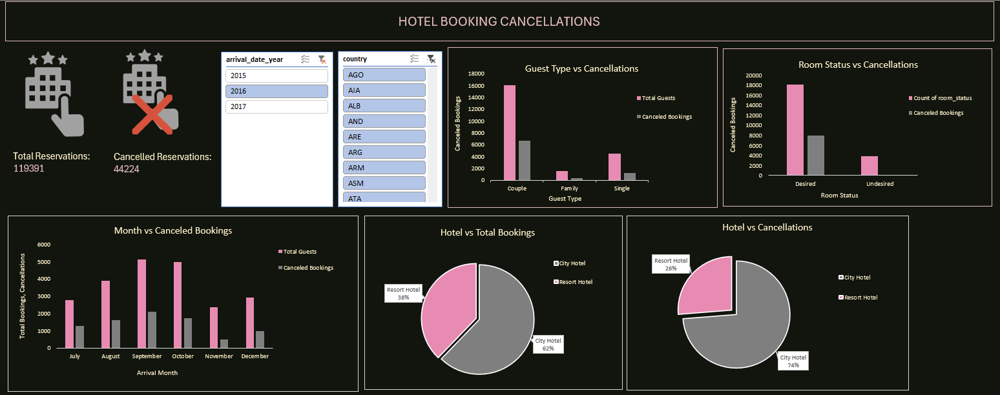

# Hotel Booking Demand 

## Overview
This project is an **Excel-based** hotel booking analysis using pivot tables along with dashboard.  

The purpose of this project was to practice data cleaning, pivot table creation and dashboard creation using Microsoft Excel.

The result is an *interactive dashboard* that provides key insights into number of cancellations based on the type of guest(couple, family or single), whether the guest got their desired room or not, arrival month, hotel type (City Hotel or Resort Hotel).

---

## Dataset
Source: Online Hotel Booking 

Link: https://www.kaggle.com/code/mohamedzayton/hotel-booking

**Note**: Only first 200 rows of the dataset were used for analysis. This was done to make handling data in Excel manageable.

- The Dataset includes following information:
  - Hotel Type (City Hotel or Resort Hotel)
  - Cancellation (Guest cancelled the booking or not)
  - Arrival Date Year
  - Arrival Date Month
  - Number of Adults
  - Number of Children
  - Number of Babies
  - Country
  - Reserved Room Type
  - Assigned Room Type
  - Reservation Status
  - Reservation Status Date
  - Room status
  - Guest Type (Couple / Single / Family)
  

---

## Data Preparation 
Basic data cleaning was performed directly in Excel using Power Query Editor including:
- Filtering the dataset (keeping only required columns)
- Adding required columns
- Removing duplicate records
- Handling missing values 

---

## Analysis & Pivot Tables
An analysis was done using Excel pivot tables, which gave the following insights:
- guest_type vs Total Guests (Count of room_status) vs Canceled Bookings (Sum of is_canceled): Maximum bookings were by couples and max cancellations were also by couples

- room_status vs Count of room_status vs Canceled Bookings(Sum of is_canceled): Number of cancellations are not much affected by whether guest got their desired room or not

- arrival_date_month vs Total Guests(Count of arrival_date_month) vs Canceled Bookings(Sum of is_canceled): Maximum number of guests and maximum number of cancellations were in the month of August

- hotel vs  Total Bookings (Count of hotel): Number of reservations were more in City Hotel than in Resort Hotel 

- hotel vs Canceled Bookings(Sum of is_canceled): Number of cancellations were more in City Hotel

*Slicers* were added to enable interactive filtering on the basis of the three arrival_date_year i.e, 2015, 2016, 2017 and on the basis of Country.

---

## Dashboard
The Excel dashboard provides detailed insights using:
- Pivot charts
- Slicers 

A preview of the dashboard is shown below:

---

## Tools Used
- Microsoft Excel
  - Power Query Editor
  - Formulas
  - Filters
  - Pivot Tables
  - Charts
  - Slicers

---

## Project Structure
- data
  - raw data: HotelBookingData.csv
  - cleaned data: HotelBookingCleaned.csv
- .gitignore
- Pivot Tables: HotelBookingPivot.csv
- Dashboard in Excel: HotelBookingDashboard.xlsx
- Dashboard Image: HotelBookingDemandDashboardImage.png
- README.md

**Note**: This project is intended for learning and analysis using Excel.

